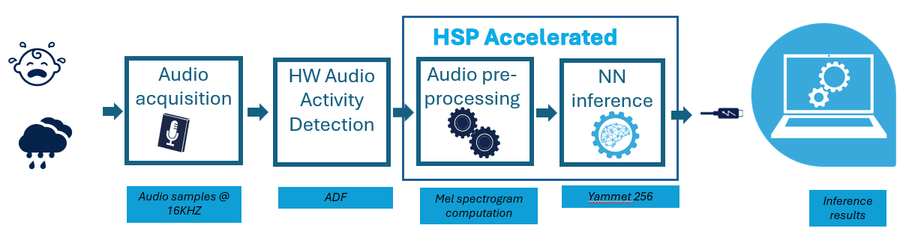
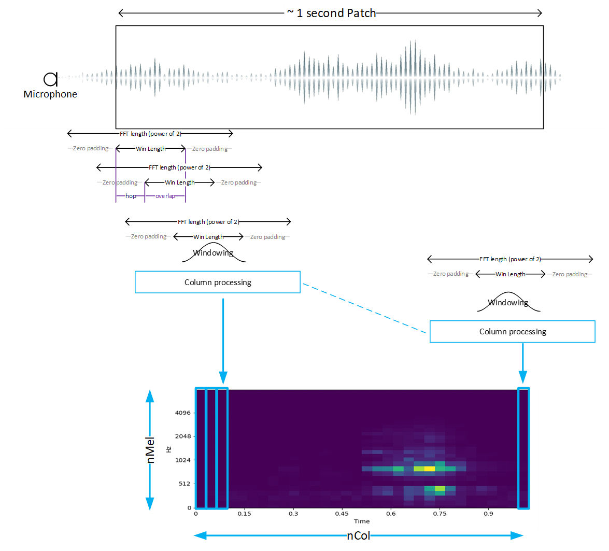

# Audio Getting Started Package

This project provides an STM32 Microcontroler embedded real time environement
to execute [ST Edge AI](https://www.st.com/en/development-tools/stedgeai-core.html)
generated model targetting audio applications. The purpose of this package is to
stream physical data acquired by sensors into a processing chain including a
preprocessing step that typically would perform a first level of feature
extraction, the machine learning inference itself before exposing the results
to the user in real time through a serial console.
The project implements only a bare metal version.

## Keywords

Getting Started, Audio, Audio Event Detection, ST Edge AI, STM32U3, HSP

## Table of Contents

- [Hardware and Software environment](#hardware-and-software-environment)
  - [Hardware support](#hardware-support)
  - [Serial port configuration](#serial-port-configuration)
  - [Toolchains support](#toolchains-support)
- [Quickstart using prebuilt binaries](#quickstart-using-prebuilt-binaries)
- [Configuration](#configuration)
  - [Application](#application)
  - [AED example](#aed-example)
- [History](#history)

## Hardware and Software environment

### Hardware support

- MB2222-U3C5ZIQ Nucleo board
- [X-NUCLEO-IKS02A1](https://www.st.com/en/evaluation-tools/x-nucleo-iks02a1.html)
expansion board

Plug the X-NUCLEO-IKS01A2 expansion board into the Nucleo board then plug the
Nucleo board via CN1 connector (USB STLINK) into your computer using a USB cable
type C.

### Serial port configuration

This package outputs results and useful information (depending on the configured
level of verbosity) through a serial connection. The default configuration of
the serial link is:

- Speed = 115200 bauds
- Data = 8 bit
- Parity = None
- Stop bit = 1 bit
- Flow control = none

### Toolchains support

- [STM32CubeProgrammer](https://www.st.com/en/development-tools/stm32cubeprog.html) **v2.22.0**
- [STM32CubeIDE](https://www.st.com/en/development-tools/stm32cubeide.html) **v2.1.0**
- [STEdgeAI](https://www.st.com/en/development-tools/stedgeai-core.html)  **v4.0.0**

## Quickstart using prebuilt binary

One use case is provided:

- Audio Event Detection (aed): Automatically recognizing events like a baby
  crying or a clapping.



One corresponding binary is provided in binary directory and must be programmed
in the board internal flash using the following procedure:

  1. Install STM32CubeProgrammer in your system.
  2. Add `STM32_Programmer_CLI` to your PATH.
  3. Program the board with
    `STM32_Programmer_CLI -c port=swd -w Binary/STM32U3-2M-GettingStarted-AED.elf`
  4. Power cycle the board

Start the application by pressing the reset button on the board. The application
will start sending logs to the console through the USB cable to the PC serial
console (you may choose
[Teraterm](https://teratermproject.github.io/index-en.html)).
In Tera Term terminal configuration, set the receive newline to CR.

The welcome screen will display the system configuration and the status of the
inference processing:

```Terminal
========================================
STM32U3-2M-GettingStarted-AED v1.0.0
Build date & time: Feb 26 2026 13:48:21
Compiler: GCC 14.3.1
HAL: 1.3.0
STEdgeAI Tools: 4.0.0
NN model: yamnet_256_64x96_tl_int8_5_classes
========================================


---------------------------------------------------------------
        System configuration (Bare Metal)
---------------------------------------------------------------

Log Level: Info

Compiled with GCC 14.3.1
STM32 device configuration...
 Device       : DevID:0x042a (STM32U3x5) RevID:0x1000
 Core Arch.   : M33 - FPU  used
 HAL version  : 0x01030000
 SYSCLK clock : 96 MHz
 HCLK clock   : 96 MHz
 ICACHE       : True


HSP Acceleration used for Preprocessing

---------------------------------------------------------------


ST.AI RT
---------------------------------------------------------------
 tools version   : xxx
 network rt lib  : xxx
   compiled with : GCC 13.3.1

Network informations...
 model signature : 0x090a9f9c7eb32c59dd460d0e4e863094
 c-name          : network
 c-signature     : 0
 c-datetime      : 2025-09-16T09:44:19+0200
 c-compile-time  : Sep 17 2025 14:58:43
 macc            : 23927578
 runtime version : 11.1.0
 n_inputs : 1 (allocate-inputs)
  i[0]  (1,96,64,1) i8(7.0) (fmt=0x00840440) @0x2000D014/6144
        scale=0.058037 zeropoint=31
 n_outputs : 1 (allocate-outputs)
  o[0]  (1,5) float32 (fmt=0x00821040) @0x200003DC/20
 n_activations : 1
  a[0]  u8(8.0) @0x200003D4/101440
 n_states : 0
 n_weights : 1 (allocate-weights)
  w[0]  u8(8.0) @0x200003D4/137876
MEL spectrogram 64 mel x 96 col
- sampling freq : 16000 Hz
- acq period    : 960 ms
- window length : 400 samples
- hop length    : 160 samples

---------------------------------------------------------------
# Start Processing
---------------------------------------------------------------
| Vu meter          | Time(s) |  Cpu  |  Pre  |  AI   | Post  |
                    | 4       | 14.33%|  1.66%| 12.67%|  0.00%|
```

When the signal level is above a certain threshold, the following types of audio
events can be detected:

- chirping_birds
- clapping
- crying_baby
- dog
- rooster

You can play sound samples corresponding to these events to test the system.

Various useful information are displayed on the console such as cpu spent for AI
infering or preprocessing.
A small "Vu Meter" is provided to visualize the audio input level.

The latest detected class is shown along with the time stamp and the probability
of each class is also shown, in a blind way, without class labels.

```Terminal

---------------------------------------------------------------
# Start Processing
---------------------------------------------------------------
| Vu meter          | Time(s) |  Cpu  |  Pre  |  AI   | Post  |
                    | 92      | 13.01%|  1.53%| 11.47%|  0.00%|

               "clapping" detected after 92 s
---------------------------------------------------------------
 0 97  0  1  0
```

Once you have verified the system is working as expected, you can stop the
application by hitting any key on the console and check real time statistics.

```Terminal
---------------------------------------------------------------
# Stop Processing
---------------------------------------------------------------

                       CPU timing summary
---------------------------------------------------------------
| Statistics                  | Pre-Processing | AI inference |
---------------------------------------------------------------
| Number of call              |             543|           347|
| Average (ms)                |           16.61|        126.60|
| Relative load (%)           |            0.22|          1.05|
---------------------------------------------------------------
```

### HSP impact on AI inference performance

On **STM32U3C5**, the **HSP IP** provides a significant acceleration for AI Inference.
Using the same NN model (`yamnet_256_64x96_tl_int8_5_classes`), measured average inference
time drops from **412.24 ms** (without HSP) to **126.60 ms** (with HSP), about **3.26x speed-up**.
This gap highlights why HSP is a key feature for edge AI on STM32U3B5/3C5 lines.

| Configuration | NN model | Average AI inference (ms) |
|---|---|---:|
| HSP enabled | `yamnet_256_64x96_tl_int8_5_classes` | 126.60 |
| HSP disabled | `yamnet_256_64x96_tl_int8_5_classes` | 412.24 |


## Configuration

The user has the possibility to override the default application configuration
by altering  `<getting-start-install-dir>/Core/Inc/app_config.h`, and the
AI model by altering `<getting-start-install-dir>/Dpu/Inc/ai_model_config.h`.

### Application

In  `<getting-start-install-dir>/Core/Inc/app_config.h`,you can change
the default verbosity of the application by setting the `LOG_LEVEL`:

```C
#define LOG_LEVEL LOG_INFO
```

You migth also want to adapt the serial link baud rate:

```C
#define USE_UART_BAUDRATE 115200
```

### AED example

The example provided below is based on Yamnet 256 model provided in the
[ST model zoo](https://github.com/STMicroelectronics/stm32ai-modelzoo).

In `<getting-start-install-dir>/Dpu/Inc/ai_model_config.h`, first describes the
number and the nature of the model output and its type:

```C
#define CTRL_X_CUBE_AI_MODEL_NB_OUTPUT         (1U)
#define CTRL_X_CUBE_AI_MODEL_OUTPUT_1          (CTRL_AI_CLASS_DISTRIBUTION)
```

Then you describe the class indexes and their labels in this way:

```C
#define CTRL_X_CUBE_AI_MODEL_CLASS_NUMBER        (5U)
#define CTRL_X_CUBE_AI_MODEL_CLASS_LIST          {"chirping_birds","clapping",\
                                                  "crying_baby","dog","rooster"}
```

Now you can select audio preprocessing type:

```C
#define CTRL_X_CUBE_AI_PREPROC                 (CTRL_AI_SPECTROGRAM_LOG_MEL)
```

For spectrogram log mel pre processing you can specify the various parameters of
the patch processing:



The parameters are:

```C
#define CTRL_X_CUBE_AI_SPECTROGRAM_NMEL          (64U)
#define CTRL_X_CUBE_AI_SPECTROGRAM_COL           (96U)
#define CTRL_X_CUBE_AI_SPECTROGRAM_HOP_LENGTH    (160U)
#define CTRL_X_CUBE_AI_SPECTROGRAM_NFFT          (512U)
#define CTRL_X_CUBE_AI_SPECTROGRAM_WINDOW_LENGTH (400U)
#define CTRL_X_CUBE_AI_SPECTROGRAM_NORMALIZE     (0U)
#define CTRL_X_CUBE_AI_SPECTROGRAM_FORMULA       (MEL_HTK)
#define CTRL_X_CUBE_AI_SPECTROGRAM_FMIN          (125U)
#define CTRL_X_CUBE_AI_SPECTROGRAM_FMAX          (7500U)
#define CTRL_X_CUBE_AI_SPECTROGRAM_TYPE          (SPECTRUM_TYPE_MAGNITUDE)
#define CTRL_X_CUBE_AI_SPECTROGRAM_LOG_FORMULA   (LOGMELSPECTROGRAM_SCALE_LOG)
```

For optimizing Mel Spectrogram computational performances the following *L*ook
*U*p *T*ables (*LUT*) needs to be provided:

- the smoothing window to be applied before the Fast Fourrier transform , this
is typically an Hanning window the table is named with the following defines:

```C
#define CTRL_X_CUBE_AI_SPECTROGRAM_WIN           (user_win)
```

- the Mel filters taps. Only non nul taps are provided in a concatenated form,
which is why start and stop indexes are provided in separated tables

```C
#define CTRL_X_CUBE_AI_SPECTROGRAM_MEL_LUT       (user_melFiltersLut)
#define CTRL_X_CUBE_AI_SPECTROGRAM_MEL_START_IDX (user_melFilterStartIndices)
#define CTRL_X_CUBE_AI_SPECTROGRAM_MEL_STOP_IDX  (user_melFilterStopIndices)
```

Typically, *LUT*s can be generated by the ST model zoo deployment script.
Alternatively python scripts are provided in
`<getting-start-install-dir>/Utils/GenHeader`.

These *LUT*s are defined in
`<getting-start-install-dir>/Dpu/Src/user_mel_tables.c` and declared in
`<getting-start-install-dir>/Dpu/Inc/user_mel_tables.h`

You will now describe the digital microphone that will connect to the AI
processing chain:

```C
#define CTRL_X_CUBE_AI_SENSOR_TYPE            (COM_TYPE_MIC)
#define CTRL_X_CUBE_AI_SENSOR_ODR             (16000.0F)
```

## How to update my project with a new version of ST Edge AI

The neural network model files (`network.c/h`, etc.) included in this project were generated using [STEdgeAI](https://www.st.com/en/development-tools/stedgeai-core.html) version 4.0.0.

If you use a different version of STEdgeAI to generate these model files, please follow the STEdgeAI instructions on [How to update my project with a new version of ST Edge AI Core](https://stedgeai-dc.st.com/assets/embedded-docs/stneuralart_faqs_update_version.html) to update your project.
